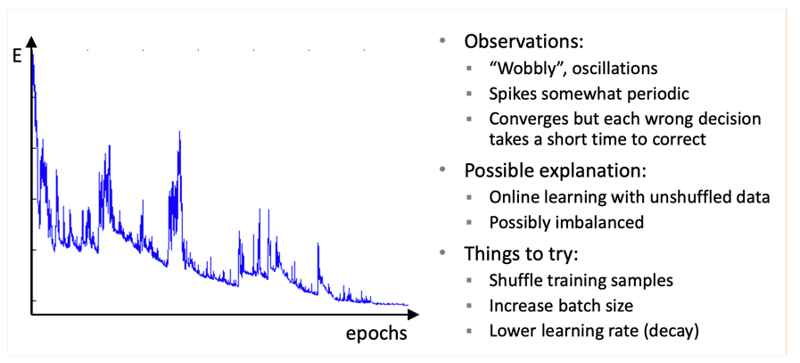

### 1. Had to reduce the batch size to 16 to avoid out of memory error. 
    This is because the BERT model is quite large and requires a lot of memory to train. Reducing the batch size allows the model to fit into memory, but it may also slow down training.

### 2. Noticed that during training this problem occurred. Most likely caused because I lowered the batch size.
